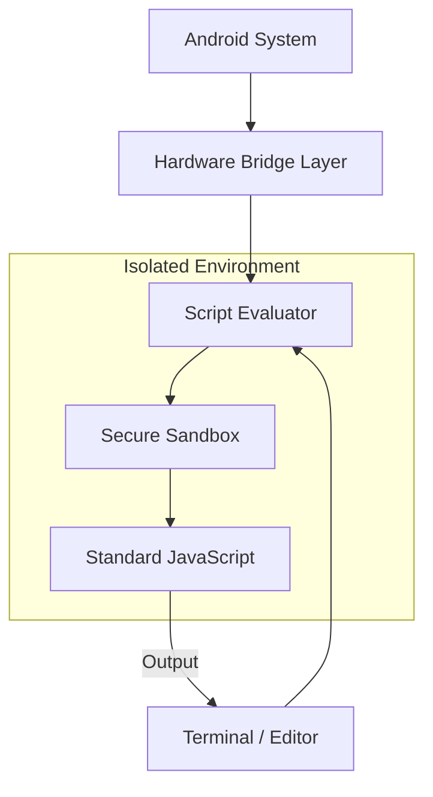

<p align="center">
  
</p>

# PhoneDo

PhoneDo is an automation engine that lets you control Android hardware using standard JavaScript. It bridges web logic with native features like WiFi, Bluetooth, SMS, and the device file system, allowing you to build mobile automation tools using the code you already know.

[API Reference](PHONEDO_DOCS_README.MD) | [Community Support](https://groups.google.com/g/phonedo) | [Discord](https://discord.gg/b4ENrd2FAP)

---

## The Power of Standard JavaScript

PhoneDo does not require you to learn a new scripting language. It uses **Vanilla JavaScript**, meaning any skill you have in modern JS development is directly transferable.

* **Familiar Syntax**: Use standard ES6+ features like async/await, arrow functions, and destructuring.
* **Built-in Functions**: Leverage native JS methods for array manipulation, string formatting, and mathematical operations.
* **No New Learning Curve**: If you understand JavaScript, you already know how to use PhoneDo. The native bridges are simply global objects added to the environment you are already comfortable with.

---

## Quick Start

Follow these steps to run your first script:

1. Open the Script Editor from the app dashboard.
2. Go to File > New Script. A basic template will be created for you.
3. Write your logic inside the (async () => { ... })() block.
4. Press the Run button to start your script.
5. Switch to the Terminal tab to see your output and logs.

> [!TIP]
> You can run any saved script from the Terminal by typing: run -i "filename.pjs".

---

## How it Works

PhoneDo runs your code in a secure container. This keeps your logic separate from the rest of the app while providing a serialized message bus to native hardware.



### Security and Stability
* Isolated Sandbox: Your code runs in a restricted iframe environment. It cannot access your private data or the app's internal files.
* Frozen Bridge Objects: Native bridges are injected as protected global objects. They are frozen to ensure their behavior cannot be modified by scripts.
* Error Handling: Standard JS try/catch patterns work as expected. PhoneDo catches exceptions and displays detailed logs in the terminal.

---

## Writing Scripts (.pjs)

Scripts use the .pjs extension and are executed as standard JavaScript files in an asynchronous environment.

### Script Headers
New scripts include a metadata header used by the IDE to track project details:

```javascript
/*
  Script Name     : MyProject.pjs
  Description     : Standard JS processing with native bridges.
  PhoneDo Version : 1.4.0
*/
```

### Using Vanilla JS with Native Bridges
You can combine standard JS logic with hardware calls seamlessly. Because the environment is asynchronous, `await` is used for all hardware-level operations to keep the execution flow linear.

---

## Hardware Bridge Examples

These examples show how to combine standard JavaScript logic with the device bridge system.

<details>
<summary><b>SMS and Messaging</b></summary>
<blockquote>Manage messaging services using standard JS filtering.</blockquote>

```javascript
// Send a text message
await SMS.send('555-0100', 'Alert: System check passed.');

// Use standard Array.filter to find specific messages
const allLogs = await SMS.list({ box: 'inbox' });
const alerts = allLogs.filter(msg => msg.body.includes('Priority'));
console.log(`Found ${alerts.length} priority alerts.`);
```
</details>

<details>
<summary><b>WiFi Management</b></summary>
<blockquote>Control wireless hardware and process scan results.</blockquote>

```javascript
// Scan and sort networks by signal strength using Array.sort
const networks = await WIFI.scan();
const strongest = networks.sort((a, b) => b.level - a.level)[0];

console.log(`Connecting to strongest AP: ${strongest.ssid}`);
await WIFI.connect({ ssid: strongest.ssid, password: 'secure_password' });
```
</details>

<details>
<summary><b>Network Diagnostics</b></summary>
<blockquote>Perform connectivity health checks.</blockquote>

```javascript
// Check connectivity type
const conn = await network.getConnectionType();

// Use a simple loop for multiple pings
for (let i = 0; i < 3; i++) {
    const stats = await network.ping('google.com');
    console.log(`Ping ${i+1}: ${stats.time}ms`);
}
```
</details>

<details>
<summary><b>File System</b></summary>
<blockquote>Persistent storage with JSON serialization.</blockquote>

```javascript
const path = fs._app_rootpath;

// Use standard JSON methods to serialize your data before saving
const data = { lastRun: new Date().toISOString(), status: 'ok' };
await fs.writeTextFile(path, 'status.json', JSON.stringify(data, null, 2));
```
</details>

<details>
<summary><b>HTTP Client</b></summary>
<blockquote>Web requests for external data integration.</blockquote>

```javascript
// Fetch external data and process it using standard JS
const response = await http.sendRequest('https://api.example.com/data');
if (response.status === 200) {
    const records = response.data.records;
    console.log(`Retrieved ${records.length} items from API.`);
}
```
</details>

<details>
<summary><b>Device and System</b></summary>
<blockquote>Access hardware metadata and trigger feedback.</blockquote>

```javascript
// Use template literals for clean output
console.log(`Device: ${device.model} | Battery: ${device.batteryLevel}%`);

// Run haptic feedback
device.vibrate(200);
device.beep();
```
</details>

<details>
<summary><b>Voice and Audio</b></summary>
<blockquote>Interface with native speech engines.</blockquote>

```javascript
await utter.speak('Ready for voice command.');

// Capturing speech as a standard string for processing
const rawCommand = await utter.listen();
const command = rawCommand.toLowerCase().trim();

if (command.includes('start')) {
    console.log('Voice trigger activated.');
}
```
</details>

<details>
<summary><b>SIM Information</b></summary>
<blockquote>Retrieve carrier and network metadata.</blockquote>

```javascript
const simData = await sim.getInfo();
console.log(`Carrier: ${simData.carrierName} | Country: ${simData.countryCode}`);
```
</details>

<details>
<summary><b>Bluetooth (BLE)</b></summary>
<blockquote>Discover nearby Bluetooth Low Energy peripherals.</blockquote>

```javascript
// Scan for 10 seconds and log found device names
const devices = await bluetooth.scan(10);
devices.forEach(d => console.log(`Found: ${d.name || 'Unknown'}`));
```
</details>

<details>
<summary><b>Clipboard</b></summary>
<blockquote>Manage system clipboard content.</blockquote>

```javascript
// Set clipboard for external use
await clipboard.setText('Generated_Key_123');

// Process text from the clipboard
const content = await clipboard.getText();
console.log(`Clipboard length: ${content.length}`);
```
</details>

<details>
<summary><b>Browser Viewport</b></summary>
<blockquote>Open browser instances for web content.</blockquote>

```javascript
// Open a safe-mode viewport for login flows
await browser.openSafe('https://github.com/MurageKabui/PhoneDo');
```
</details>

<details>
<summary><b>Permissions</b></summary>
<blockquote>Audit hardware access at runtime.</blockquote>

```javascript
const hasCam = await permission.check('camera');
if (!hasCam) await permission.request('camera');
```
</details>

<details>
<summary><b>Timers and Flow</b></summary>
<blockquote>Thread timing and visual progress.</blockquote>

```javascript
// Standard thread sleep
await sleep(2000);

// Progress updates in the console
await sleepWithProgress(5000, (p) => {
    process.stdout.write(`\rProgress: ${p}%`);
});
```
</details>

<details>
<summary><b>User Interface</b></summary>
<blockquote>Control spinners and native dialogs.</blockquote>

```javascript
// System-level loading state
spinner.show('Busy', 'Processing data...');
await doHeavyWork();
spinner.hide();
```
</details>

---

## Terminal Commands

The terminal is the primary interface for execution and diagnostics.

| Command | Action | Implementation Detail |
|:---|:---|:---|
| slist | Manage saved scripts | Retrieves metadata from internal SQLite store. |
| run | Execute a script | Runs a .pjs file within the sandboxed VM. |
| sysinfo | System metadata | Dumps OS, battery, and hardware statistics. |
| ipconfig | Network settings | Lists interface IP and MAC addresses. |
| ping | Latency check | Performs ICMP requests through the native stack. |
| cls | Clear terminal | Purges the JQConsole display buffer. |

---

## Tech Stack and Architecture

PhoneDo bridges high-level JavaScript with low-level Android services.

| Component | Responsibility | Base Technology | Interaction Model |
|:---|:---|:---|:---|
| **Host Application** | Core Lifecycle | Java (Android SDK) | Manages system threads and permissions. |
| **Logic Engine** | Script Evaluation | JavaScript (Sandbox) | Evaluates standard JS in a restricted VM. |
| **Hardware Bridges**| Native Access | Cordova Plugins | Serialized communication with native layers. |
| **User Interface** | App Dashboard | Vue.js / Bootstrap | Responsive frontend for script management. |
| **Code Editor** | Development | ACE.js | High-performance editor with JS syntax support. |
| **Terminal** | Output & TUI | JQConsole | Custom command parser for real-time logs. |
| **Storage Layer** | Persistence | SQLite3 | Reliable store for scripts and application state. |

---

## Installation

Due to its hardware requirements, PhoneDo is installed via adb.

1. Enable Developer Options and Unknown Sources in your settings.
2. Install the APK:
   ```bash
   adb install -r PhoneDo.apk
   ```

---

**Built by [MurageKabui](https://github.com/MurageKabui)**
Logo: [namishkashyap](https://linktr.ee/namishkashyap)
