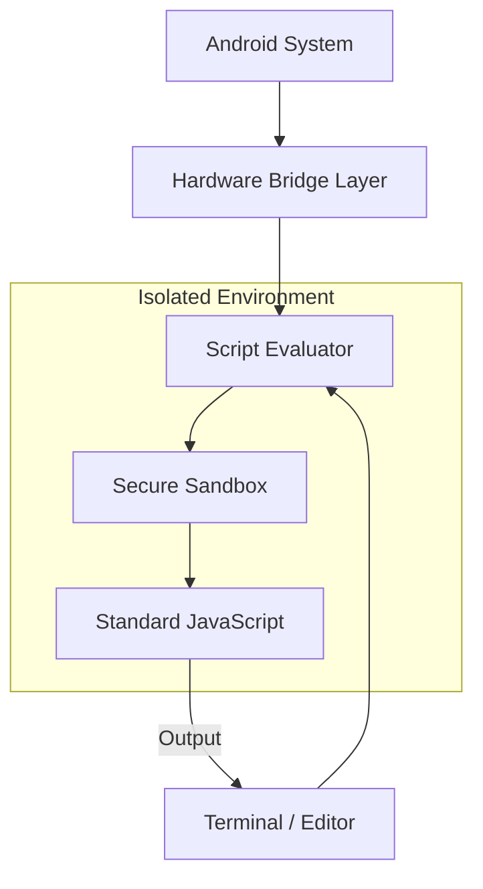

<p align="center">
  
</p>

<p align="center">
  
  
  
</p>

<p align="center">
  PhoneDo is an app that bridges standard JavaScript with Android’s native features. It allows you to write scripts to manage hardware and system services including WiFi, Bluetooth, SMS, SIM metadata, and more , using familiar coding patterns in a mobile environment.
</p>

<p align="center">
  <a href="PHONEDO_DOCS_README.MD">API Reference</a> | 
  <a href="https://groups.google.com/g/phonedo">Community Support</a> | 
  <a href="https://discord.gg/b4ENrd2FAP">Discord</a>
</p>

## Why ?

I created this as a personal scripting tool to avoid the overhead of full Android app development and the complexity of Termux. It is built for writing quick scripts that can fetch data from APIs, parse JSON, and interact with hardware using just a few lines of code. It is designed to stay out of the way and let you run logic directly on your phone.

<p align="center">
  
</p>

## Automated Hardware Bridges

PhoneDo exposes almost every native Android service to the JavaScript environment. Below are the primary bridges available for automation:

| Feature Category | Bridges Included |
| :--- | :--- |
| **Connectivity** | WiFi, Bluetooth (BLE), Network Diagnostics, HTTP Client |
| **Messaging** | SMS Sending, SMS Inbox Access, SMS Log Filtering |
| **Hardware** | Vibrate, Beep, Sensors, SIM Metadata, Battery Status |
| **Intelligence** | Text-to-Speech (UTTER), Speech Recognition (LISTEN) |
| **Utilities** | File System (FS), Permissions, Clipboard, Browser Viewport |
| **Interface** | Native Dialogs, Spinner Controls, Terminal TUI |

## Getting Started

Download the latest APK and the optional demo backup file from the Releases section. 

1. Launch PhoneDo and open the side navigation drawer.
2. Go to Script Editor and use File > New Script to create a workspace (e.g., hello_world.pjs).
3. Write your JavaScript in the editor and select Run > Run Script.
4. Use the Terminal tab to check script output and hardware logs.

Everything uses standard JavaScript. Hardware bridges are global objects, so you can use the same ES6 patterns you use in web development.

---

## Architecture

PhoneDo runs your code in a secure container. This keeps your logic separate from the rest of the app while providing a serialized message bus to native hardware.



### Security and Stability
* Isolated Sandbox: Your code runs in a restricted iframe environment. It cannot access your private data or the app's internal files.
* Frozen Bridge Objects: Native bridges are injected as protected global objects. They are frozen to ensure their behavior cannot be modified by scripts.
* Error Handling: Standard JS try/catch patterns work as expected. PhoneDo catches exceptions and displays detailed logs in the terminal.

---

### Script Management

Scripts use the .pjs extension and run as standard JavaScript files in an asynchronous environment. PhoneDo also supports legacy .nts files for backward compatibility.

### Metadata Generation

PhoneDo automatically generates a metadata header when you create a new script to help with project tracking.

```javascript
/*
  Script Name     : MyProject.pjs
  Date            : Mon Feb 16 2026 23:35:52 GMT+0300
  Description     : Standard JS processing with native bridges.
  PhoneDo Version : 1.4.0
*/
```

### Vanilla JS and Native Bridges

You can write standard JS logic alongside hardware calls. Since the environment is asynchronous, use await for hardware operations.

---

## Hardware Bridge Examples

These examples show how to combine standard JavaScript with the device bridges.

<details>
<summary>SMS and Messaging</summary>

```javascript
// Send a text message
await SMS.send('555-0100', 'Alert: System check passed.');

// Filter messages using standard JS
const allLogs = await SMS.list({ box: 'inbox' });
const alerts = allLogs.filter(msg => msg.body.includes('Priority'));
console.log(`Found ${alerts.length} priority alerts.`);
```
</details>

<details>
<summary><b>WiFi Management</b></summary>
<blockquote>Control wireless hardware and process scan results.</blockquote>

```javascript
// Scan and sort networks by signal strength using Array.sort
const networks = await WIFI.scan();
const strongest = networks.sort((a, b) => b.level - a.level)[0];

console.log(`Connecting to strongest AP: ${strongest.ssid}`);
await WIFI.connect({ ssid: strongest.ssid, password: 'secure_password' });
```
</details>

<details>
<summary><b>Network Diagnostics</b></summary>
<blockquote>Perform connectivity health checks.</blockquote>

```javascript
// Check connectivity type
const conn = await network.getConnectionType();

// Use a simple loop for multiple pings
for (let i = 0; i < 3; i++) {
    const stats = await network.ping('google.com');
    console.log(`Ping ${i+1}: ${stats.time}ms`);
}
```
</details>

<details>
<summary><b>File System</b></summary>
<blockquote>Persistent storage with JSON serialization.</blockquote>

```javascript
const path = fs._app_rootpath;

// Use standard JSON methods to serialize your data before saving
const data = { lastRun: new Date().toISOString(), status: 'ok' };
await fs.writeTextFile(path, 'status.json', JSON.stringify(data, null, 2));
```
</details>

<details>
<summary><b>HTTP Client</b></summary>
<blockquote>Web requests for external data integration.</blockquote>

```javascript
// Fetch external data and process it using standard JS
const response = await http.sendRequest('https://api.example.com/data');
if (response.status === 200) {
    const records = response.data.records;
    console.log(`Retrieved ${records.length} items from API.`);
}
```
</details>

<details>
<summary><b>Device and System</b></summary>
<blockquote>Access hardware metadata and trigger feedback.</blockquote>

```javascript
// Use template literals for clean output
console.log(`Device: ${device.model} | Battery: ${device.batteryLevel}%`);

// Run haptic feedback
device.vibrate(200);
device.beep();
```
</details>

<details>
<summary><b>Voice and Audio</b></summary>
<blockquote>Interface with native speech engines.</blockquote>

```javascript
await utter.speak('Ready for voice command.');

// Capturing speech as a standard string for processing
const rawCommand = await utter.listen();
const command = rawCommand.toLowerCase().trim();

if (command.includes('start')) {
    console.log('Voice trigger activated.');
}
```
</details>

<details>
<summary><b>SIM Information</b></summary>
<blockquote>Retrieve carrier and network metadata.</blockquote>

```javascript
const simData = await sim.getInfo();
console.log(`Carrier: ${simData.carrierName} | Country: ${simData.countryCode}`);
```
</details>

<details>
<summary><b>Bluetooth (BLE)</b></summary>
<blockquote>Discover nearby Bluetooth Low Energy peripherals.</blockquote>

```javascript
// Scan for 10 seconds and log found device names
const devices = await bluetooth.scan(10);
devices.forEach(d => console.log(`Found: ${d.name || 'Unknown'}`));
```
</details>

<details>
<summary><b>Clipboard</b></summary>
<blockquote>Manage system clipboard content.</blockquote>

```javascript
// Set clipboard for external use
await clipboard.setText('Generated_Key_123');

// Process text from the clipboard
const content = await clipboard.getText();
console.log(`Clipboard length: ${content.length}`);
```
</details>

<details>
<summary><b>Browser Viewport</b></summary>
<blockquote>Open browser instances for web content.</blockquote>

```javascript
// Open a safe-mode viewport for login flows
await browser.openSafe('https://github.com/MurageKabui/PhoneDo');
```
</details>

<details>
<summary><b>Permissions</b></summary>
<blockquote>Audit hardware access at runtime.</blockquote>

```javascript
const hasCam = await permission.check('camera');
if (!hasCam) await permission.request('camera');
```
</details>

<details>
<summary><b>Timers and Flow</b></summary>
<blockquote>Thread timing and visual progress.</blockquote>

```javascript
// Standard thread sleep
await sleep(2000);

// Progress updates in the console
await sleepWithProgress(5000, (p) => {
    process.stdout.write(`\rProgress: ${p}%`);
});
```
</details>

<details>
<summary><b>User Interface</b></summary>
<blockquote>Control spinners and native dialogs.</blockquote>

```javascript
// System-level loading state
spinner.show('Busy', 'Processing data...');
await doHeavyWork();
spinner.hide();
```
</details>

## PhoneDo Terminal

The terminal includes a TUI designed for diagnostics and script execution.

<p align="center">
  
</p>

| Command | Action | Description |
|:---|:---|:---|
| `slist` | Manage Scripts | Utility for listing and managing your saved scripts. |
| `run` | Execute Script | Runs a script within the sandboxed environment. |
| `beep` | Audio Feedback | Plays a system beep for audible script indicators. |
| `ipconfig` | Network Status | Retrieves IP information for the active connection. |
| `ifconfig` | Network Status | Alias for `ipconfig`. |
| `cls` / `clear` | Clear Screen | Purges the terminal display buffer. |
| `exit` | Terminate | Quits the current terminal instance. |
| `time` | System Time | Prints the current system time to the standard output. |
| `sysinfo` | Device Metadata | Dumps OS, battery, and hardware statistics. |
| `ping` | Latency Check | Sends ICMP requests to check network host connectivity. |

## Tech Stack

PhoneDo connects high-level JavaScript to Android services.

| Component | Responsibility | Technology |
|:---|:---|:---|
| Host App | Lifecycle and permissions | Java |
| Logic Engine | Script evaluation | JavaScript Sandbox |
| Hardware Bridges| Native access | Cordova Plugins |
| UI | Menus and management | Vue.js |
| Editor | Code development | ACE.js |
| Terminal | Logs and TUI | JQConsole |
| Storage | Persistence | SQLite3 |

## Installation

This app requires hardware access and is best installed via ADB.

1. Enable Unknown Sources in your device security settings.
2. Install the APK:
   ```bash
   adb install -r PhoneDo.apk
   ```
3. To load demo scripts, restore the backup file:
   ```bash
   adb restore PhoneDoExamples.ab
   ```
4. Grant all requested permissions in the app settings to ensure scripts run correctly.

## Contributing

You can report bugs or suggest features through the issue tracker. Pull requests for core logic or documentation improvements are welcome. Join the community group to discuss development.

## Credits

* Lead Developer: [MurageKabui](https://github.com/MurageKabui)
* Logo Design: [namishkashyap](https://linktr.ee/namishkashyap)

<p align="center">Made with ❤️ for the Android community.</p>
