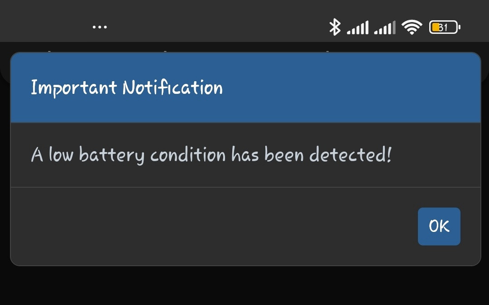
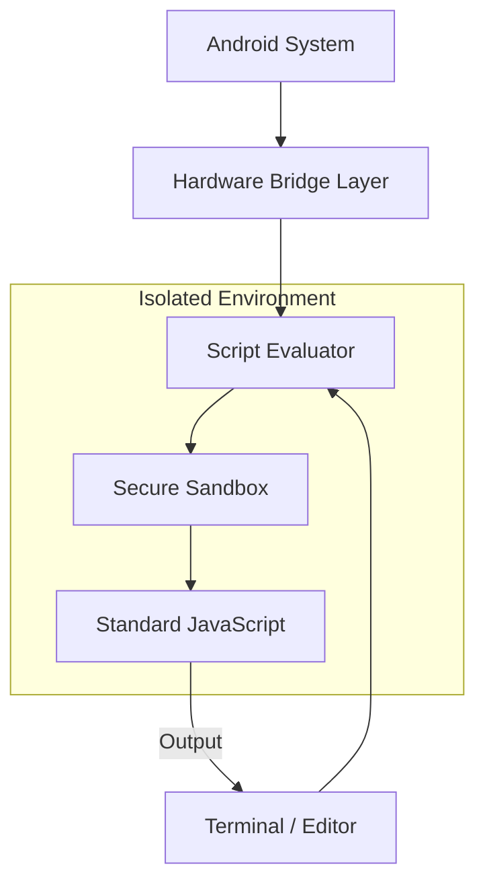

<!-- <p align="center">
  
</p>
 -->
<p align="center">
  
</p>

<p align="center">
  
  
  
</p>

<p align="center">
  PhoneDo is an app that bridges standard JavaScript with Android’s native APIs. It allows you to write scripts that interact directly with the device hardware using familiar JavaScript patterns in an Android environment.
</p>

<p align="center">
  <a href="docs/README.MD">API Reference</a> ·
  <a href="https://groups.google.com/g/phonedo">Community</a> ·
  <a href="https://discord.gg/b4ENrd2FAP">Discord</a>
</p>

## Screenshots

| Scripting | Terminal | Native Dialogs |
|:---:|:---:|:---:|
|  |  |  |
| Integrated [Ace](https://ace.c9.io/) JavaScript IDE with multiple built in themes and customizable editor preferences. | Integrated terminal for running application specific commands, managing and executing scripts. | Awaitable system dialogs |

## Table of Contents

<details>
<summary><b>Jump to a section</b></summary>

- [Features](#features)
- [Tech Stack](#tech-stack)
- [Getting Started](#getting-started)
- [Architecture](#architecture)
- [Examples](#examples)
- [Terminal](#terminal)
- [Installation](#installation)
- [Contributing](#contributing)
- [Credits](#credits)
- [License](#license)

</details>

## Features

Scripts get ready-made global objects that map to native Android services:

| Category | Bridges |
| :--- | :--- |
| Connectivity | WiFi (`WIFI`), Bluetooth LE, network diagnostics (`network`), Advanced HTTP client (`http`) + Standard fetch works |
| Telephony | SMS sending and inbox access (`SMS`), phone dialing (`sim.callNumber`), SIM metadata (`sim`) |
| Hardware | Flashlight (`flashlight`), vibration and beep (`device`), battery status, device metadata |
| Speech | Text-to-speech (`utter.speak`), speech recognition (`utter.listen`) |
| Storage & System | File system (`fs`), Android permissions (`permission`), clipboard (`clipboard`), in-app browser (`browser`) |
| Interface | Native dialogs (`alert`, `confirm`, `dialog`), spinner (`spinner`), interactive terminal input (`console.prompt`), ANSI colors |

The environment is asynchronous, so hardware calls are awaited with standard `async/await`. Everything else is the JavaScript you already know: `Array` methods, `JSON`, template literals, classes etc.

## Tech Stack

<details>
<summary><b>View components</b></summary>

| Component | Responsibility | Technology |
|:---|:---|:---|
| Host App | Lifecycle and permissions | Java |
| Logic Engine | Script evaluation | JavaScript Sandbox |
| Hardware Bridges | Native access | Cordova Plugins |
| UI | Menus and management | Vue.js |
| Editor | Code development | ACE.js |
| Terminal | Logs and TUI | JQConsole |
| Storage | Persistence | SQLite3 |

</details>

## Getting Started

Download the latest APK (and the optional demo backup) from the [Releases](../../releases) section, then:

1. Launch PhoneDo and open the top navigation drawer.
2. Go to **Script Editor**, then **File > New Script** to create a workspace (e.g. `NotifyTeam.js`).
3. Write your JavaScript and select **Run > Run Script** and press Enter.
4. Check output and hardware logs in the **Terminal**.

Here is a complete, working script. It texts the same message to a list of contacts, confirms each send in the terminal, and announces when it is done:

```javascript
const contacts = ['555-0100', '555-0142', '555-0187'];
const message = 'Meeting moved to 3 PM. See you there.';

for (const number of contacts) {
    await SMS.sendSMS(number, message);
    console.success(`Sent to ${number}`);
    await sleep(1000);
}

await utter.speak(`Done. ${contacts.length} messages sent.`);
exit();
```

That is the whole thing. No project setup, no manifest, no build. The same pattern applies to any bridge: loop over data, call the hardware, log the result.

## Architecture

Every script runs inside an isolated sandbox, separated from the host app, with a serialized message bus to native hardware.


```mermaid
graph TD
    A[Android System] --> B[Hardware Bridge Layer]
    B --> C[Script Evaluator]

    subgraph Isolated Environment
        C --> D[Secure Sandbox]
        D --> E[Standard JavaScript]
    end

    F[Terminal / Editor] --> C
    E -->|Output| F
```

### Security and Stability

Every script runs in its own sandbox, created when the script starts and destroyed when it ends, so your code stays isolated from the rest of the app. Errors never crash the app: uncaught exceptions and failed promises are caught and printed to the terminal, and normal `try/catch` works as expected. Top-level `await` works without any setup.

One script runs at a time. Starting a new script while another is running asks you to stop the current one first, and `exit()` ends a script cleanly from within.

### Script Files

Scripts are plain `.js` files. New scripts are created with a generated metadata header for project tracking:

```javascript
/*
  Script Name     : MyProject.js
  Date            : Mon Feb 16 2026 23:35:52 GMT+0300
  Description     : Standard JS processing with native bridges.
  PhoneDo Version : 1.4.0
*/
```

## Examples

<details>
<summary><b>SMS and Telephony</b></summary>

The `SMS` bridge works in both directions. Sending takes a number and a message, and the inbox comes back as a plain array, so filtering and searching messages is just standard `Array` work. The `sim` bridge places calls directly.

```javascript
// Send a text message
await SMS.sendSMS('555-0100', 'Alert: System check passed.');

// List and filter inbox messages using standard JS
const messages = await SMS.listSMS({ box: 'inbox' });
const alerts = messages.filter(msg => msg.body.includes('Priority'));
console.log(`Found ${alerts.length} priority alerts.`);

// Dial a number
await sim.callNumber('555-0100');
```
</details>

<details>
<summary><b>WiFi Management</b></summary>

`WIFI.scan()` returns the visible networks with their SSID and signal level, ready to sort and pick from. Connections use positional arguments, and on Android 10 and above the suggestion API is the preferred way to join a network.

```javascript
// Scan and sort networks by signal strength
const networks = await WIFI.scan();
const strongest = networks.sort((a, b) => b.level - a.level)[0];

// connect(ssid, bindAll, password, algorithm, isHiddenSSID)
console.log(`Connecting to strongest AP: ${strongest.SSID}`);
await WIFI.connect(strongest.SSID, false, 'secure_password', 'WPA', false);

// On Android 10+ prefer the suggestion API
await WIFI.suggestConnection(strongest.SSID, 'secure_password');

// Inspect the current connection
const ssid = await WIFI.getConnectedSSID();
const ip = await WIFI.getIP();
console.log(`Connected to ${ssid} at ${ip}`);
```
</details>

<details>
<summary><b>Network Diagnostics</b></summary>

The `network` bridge answers the basic health questions: what kind of connection is active, whether a host responds, and whether the internet is actually reachable beyond the router.

```javascript
// Check connectivity type
const conn = network.getConnectionType();
console.log(`Connection: ${conn}`);

// Ping a host and check reachability
const stats = await network.ping('google.com');
const online = await network.canConnectToInternet();
console.log(`Internet reachable: ${online}`);
```
</details>

<details>
<summary><b>File System</b></summary>

The `fs` bridge ships with constants for the useful Android directories (`APP_ROOT_DIR`, `DATA_DIR`, `CACHE_DIR`, `EX_ROOT_DIR` and others), so scripts never hardcode paths. Text files are read and written in one call, which pairs naturally with `JSON` for storing script state between runs.

```javascript
const path = fs.APP_ROOT_DIR;

// Serialize with standard JSON methods before saving
const data = { lastRun: new Date().toISOString(), status: 'ok' };
await fs.writeTextFile(path, 'status.json', JSON.stringify(data, null, 2));

// Read it back
const raw = await fs.readTextFile(path, 'status.json');
console.log(JSON.parse(raw).status);

// Directories and housekeeping
if (!(await fs.dirExists(path + 'logs'))) {
    await fs.createDirectory(path, 'logs');
}
await fs.appendTextFile(path, 'run.log', `Run at ${Date.now()}\n`);
```
</details>

<details>
<summary><b>HTTP Client</b></summary>

The `http` bridge is a native HTTP client, so requests are not subject to browser CORS limits. Responses carry a `status` code and the body as a string in `data`, and files can be downloaded straight to device storage.

```javascript
// Fetch and process external data
const response = await http.sendRequest('https://api.example.com/data', { method: 'get' });
if (response.status === 200) {
    const records = JSON.parse(response.data);
    console.log(`Retrieved ${records.length} items from API.`);
}

// Download a file straight to storage
await http.downloadFile('https://example.com/backup.zip', {}, {}, fs.APP_ROOT_DIR + 'backup.zip');

// Also available: uploadFile, setHeader, cookies, timeouts, TLS trust modes
```
</details>

<details>
<summary><b>Device and Hardware</b></summary>

The `device` object carries the phone's metadata (model, platform, manufacturer, battery level, charging state and more) as plain properties, no calls needed. Vibration, beep, and the flashlight give scripts physical feedback.

```javascript
console.log(`Device: ${device.model} | Battery: ${device.batteryLevel}%`);

// Haptic and audio feedback
device.vibrate(200);
device.beep();

// Flashlight control
await flashlight.switchOn();
await sleep(1000);
await flashlight.switchOff();
```
</details>

<details>
<summary><b>Voice and Audio</b></summary>

`utter.speak()` uses the system text-to-speech engine and accepts optional rate, pitch, and voice arguments. `utter.listen()` starts speech recognition and resolves an array of candidate matches, best match first.

```javascript
await utter.speak('Ready for voice command.');

// listen() resolves an array of recognition matches
const matches = await utter.listen();
const command = matches[0].toLowerCase().trim();

if (command.includes('start')) {
    console.log('Voice trigger activated.');
}
```
</details>

<details>
<summary><b>SIM Information</b></summary>

Reading SIM data requires a runtime permission, so the bridge includes its own check and request helpers. Once granted, `getInfo()` returns carrier and network metadata in one object.

```javascript
if (!(await sim.hasPermission())) await sim.requestPermission();

const simData = await sim.getInfo();
console.log(`Carrier: ${simData.carrierName} | Country: ${simData.countryCode}`);
```
</details>

<details>
<summary><b>Bluetooth (BLE)</b></summary>

BLE scanning is callback based: each discovered device fires the first callback, and the scan stops itself after the timeout. Beyond discovery, the bridge covers connecting to peripherals and reading, writing, and subscribing to characteristics.

```javascript
// create an array of permissions to request
const a_Permissions = [permission.BLUETOOTH, permission.BLUETOOTH_ADMIN, permission.BLUETOOTH_CONNECT, permission.BLUETOOTH_SCAN, permission.BLUETOOTH_ADVERTISE];

// Request the permissions on runtime
await permission.requestPermissions(a_Permissions);

// Callback-based scan; stops automatically after the timeout (10 seconds)
await bluetooth.scan(
    d => console.log(`Found: ${d.name || 'Unknown'} (${d.address})`),
    err => console.error(err),
    10
);

// Also available: connect, getCharacteristic, readCharacteristic, writeCharacteristic
```
</details>

<details>
<summary><b>Clipboard</b></summary>

Scripts can place text on the system clipboard, handy for handing generated values (keys, links, formatted output) to other apps.

```javascript
await clipboard.setText('Generated_Key_123');
```
</details>

<details>
<summary><b>In-App Browser</b></summary>

The `browser` bridge opens web content in several modes: a hardened safe mode that clears cache and session data for untrusted pages, fullscreen and minimal chrome variants, and a handoff to the system browser.

```javascript
// Open a hardened viewport for untrusted content
await browser.openSafe('https://github.com/MurageKabui/PhoneDo');

// Other modes: open, openFullscreen, openMinimal, openExternal (system browser)
```
</details>

<details>
<summary><b>Permissions</b></summary>

Every Android permission is available as a constant on the `permission` object, so there are no magic strings. Checks return a status object, and multiple permissions can be requested in one batch.

```javascript
const status = await permission.checkPermission(permission.CAMERA);
if (!status.hasPermission) {
    await permission.requestPermission(permission.CAMERA);
}

// Batch requests
await permission.requestPermissions([permission.READ_SMS, permission.SEND_SMS]);
```
</details>

<details>
<summary><b>Dialogs and Spinners</b></summary>

`alert()` and `confirm()` show real native dialogs and are awaitable, so a script pauses until the user responds. `confirm()` resolves to a boolean, which makes it a natural guard before destructive actions. The spinner shows a system-level busy state during long operations.

```javascript
await alert('Task complete.', 'Status');

const proceed = await confirm('Delete all logs?', 'Confirm');
if (!proceed) exit(0);

// System-level loading state
spinner.show('Busy', 'Processing data...');
await doHeavyWork();
spinner.hide();
```
</details>

<details>
<summary><b>Terminal I/O</b></summary>

Scripts can be interactive. `console.prompt()` waits for a line of input from the terminal, `console.success()` prints in a highlighted style, and the `ANSI` constants add color to any output.

```javascript
// Read input interactively
const name = await console.prompt();
console.success(`Hello, ${name}`);

// Styled output with ANSI constants
console.log(`${ANSI.GREEN}PASS${ANSI.RESET} all checks completed`);

// Pause execution
await sleep(2000);
```
</details>

## Terminal

A simple built-in terminal for diagnostics and script execution.

| Command | Description |
|:---|:---|
| `slist` | List and manage saved scripts |
| `run` | Execute a script in the sandboxed environment |
| `beep` | Play a system beep |
| `ipconfig` / `ifconfig` | Show IP information for the active connection |
| `ping` | Check network host connectivity |
| `sysinfo` | Dump OS, battery, and hardware statistics |
| `time` | Print the current system time |
| `cls` / `clear` | Clear the terminal display buffer |
| `exit` | Quit the current terminal instance |

## Installation

The app requires hardware access and is best installed via ADB.

1. Enable **Unknown Sources** in device security settings.
2. Install the APK:
   ```bash
   adb install -r PhoneDo.apk
   ```
3. Optionally restore the demo scripts:
   ```bash
   adb restore PhoneDoExamples.ab
   ```
4. Grant the requested permissions so scripts can access hardware.

## Contributing

Bug reports and feature requests go through the [issue tracker](../../issues). Pull requests for core logic or documentation are welcome. Development discussion happens in the [community group](https://groups.google.com/g/phonedo) and on [Discord](https://discord.gg/b4ENrd2FAP).

## Credits

- Lead Developer: [MurageKabui](https://github.com/MurageKabui)
- Logo Design: [namishkashyap](https://linktr.ee/namishkashyap)

## License

See [LICENSE](LICENSE).
