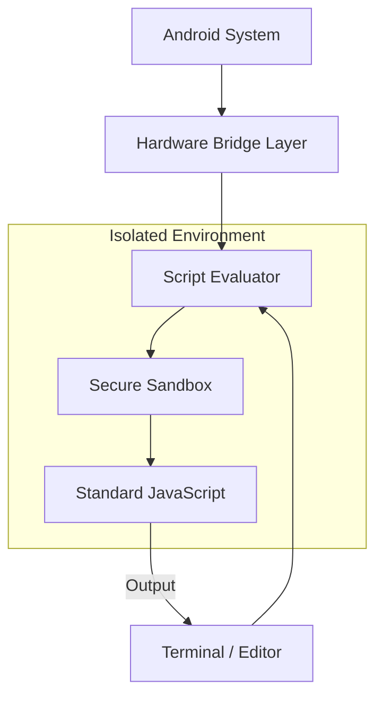

<p align="center">
  
</p>

<p align="center">
  
  
  
</p>

<p align="center">
  PhoneDo bridges standard JavaScript with Android's native services. Write scripts that control WiFi, Bluetooth, SMS, sensors, SIM metadata, and more — directly on the device, with no build step.
</p>

<p align="center">
  <a href="PHONEDO_DOCS_README.MD">API Reference</a> ·
  <a href="https://groups.google.com/g/phonedo">Community</a> ·
  <a href="https://discord.gg/b4ENrd2FAP">Discord</a>
</p>

## Motivation

Full Android app development is heavy for small automation tasks, and Termux carries its own complexity. PhoneDo occupies the middle ground: a scripting environment where a few lines of JavaScript can fetch data from an API, parse JSON, and talk to device hardware. It stays out of the way and lets you run logic directly on your phone.

<p align="center">
  
</p>

## Hardware Bridges

Nearly every native Android service is exposed to the JavaScript environment:

| Category | Bridges |
| :--- | :--- |
| Connectivity | WiFi (`WIFI`), Bluetooth LE, Network Diagnostics (`network`), HTTP Client (`http`) |
| Telephony | SMS Sending and Inbox Access (`SMS`), Phone Dialing (`sim.callNumber`), SIM Metadata (`sim`) |
| Hardware | Flashlight (`flashlight`), Vibrate and Beep (`device`), Battery Status, Device Metadata |
| Speech | Text-to-Speech (`utter.speak`), Speech Recognition (`utter.listen`) |
| Utilities | File System (`fs`), Android Permissions (`permission`), Clipboard (`clipboard`), Browser Viewport (`browser`), Timers (`sleep`) |
| Interface | Native Dialogs (`alert`, `confirm`, `dialog`), Spinner (`spinner`), Terminal I/O (`console.prompt`, ANSI colors) |

## Getting Started

Download the latest APK (and the optional demo backup) from the [Releases](../../releases) section, then:

1. Launch PhoneDo and open the side navigation drawer.
2. Go to **Script Editor** → **File > New Script** to create a workspace (e.g. `hello_world.pjs`).
3. Write your JavaScript and select **Run > Run Script**.
4. Check output and hardware logs in the **Terminal** tab.

Scripts are standard JavaScript. Hardware bridges are injected as global objects, so the same ES6 patterns used in web development apply.

## Architecture

Scripts run in an isolated container, separated from the host app, with a serialized message bus to native hardware.


```mermaid
graph TD
    A[Android System] --> B[Hardware Bridge Layer]
    B --> C[Script Evaluator]

    subgraph Isolated Environment
        C --> D[Secure Sandbox]
        D --> E[Standard JavaScript]
    end

    F[Terminal / Editor] --> C
    E -->|Output| F
```

### Security and Stability

- **Isolated sandbox** — each script runs in its own hidden sandboxed iframe, created on run and torn down on exit. Scripts cannot reach the host app's internals.
- **Frozen bridge objects** — API objects (`fs`, `WIFI`, `http`, `device`, ...) are injected with `Object.freeze`; scripts cannot modify their behavior.
- **Strict mode** — scripts execute in `"use strict"` inside an async wrapper, so top-level `await` works out of the box.
- **Error handling** — standard `try/catch` works as expected. Uncaught exceptions and unhandled promise rejections are caught and logged to the terminal instead of crashing the app.
- **Single execution slot** — one script runs at a time. Starting a new script while one is running prompts you to stop the current one first.

### Script Management

Scripts use the `.pjs` extension and run as standard JavaScript in an asynchronous environment. Legacy `.nts` files are supported for backward compatibility.

New scripts are created with a generated metadata header for project tracking:

```javascript
/*
  Script Name     : MyProject.pjs
  Date            : Mon Feb 16 2026 23:35:52 GMT+0300
  Description     : Standard JS processing with native bridges.
  PhoneDo Version : 1.4.0
*/
```

The environment is asynchronous — use `await` for hardware operations.

## Examples

<details>
<summary><b>SMS and Telephony</b></summary>

```javascript
// Send a text message
await SMS.sendSMS('555-0100', 'Alert: System check passed.');

// List and filter inbox messages using standard JS
const messages = await SMS.listSMS({ box: 'inbox' });
const alerts = messages.filter(msg => msg.body.includes('Priority'));
console.log(`Found ${alerts.length} priority alerts.`);

// Dial a number
await sim.callNumber('555-0100');
```
</details>

<details>
<summary><b>WiFi Management</b></summary>

```javascript
// Scan and sort networks by signal strength
const networks = await WIFI.scan();
const strongest = networks.sort((a, b) => b.level - a.level)[0];

// connect(ssid, bindAll, password, algorithm, isHiddenSSID)
console.log(`Connecting to strongest AP: ${strongest.SSID}`);
await WIFI.connect(strongest.SSID, false, 'secure_password', 'WPA', false);

// On Android 10+ prefer the suggestion API
await WIFI.suggestConnection(strongest.SSID, 'secure_password');
```
</details>

<details>
<summary><b>Network Diagnostics</b></summary>

```javascript
// Check connectivity type
const conn = network.getConnectionType();
console.log(`Connection: ${conn}`);

// Ping a host and check reachability
const stats = await network.ping('google.com');
const online = await network.canConnectToInternet();
console.log(`Internet reachable: ${online}`);
```
</details>

<details>
<summary><b>File System</b></summary>

```javascript
// Built-in directory constants: APP_ROOT_DIR, DATA_DIR, CACHE_DIR, EX_ROOT_DIR, ...
const path = fs.APP_ROOT_DIR;

// Serialize with standard JSON methods before saving
const data = { lastRun: new Date().toISOString(), status: 'ok' };
await fs.writeTextFile(path, 'status.json', JSON.stringify(data, null, 2));

// Read it back
const raw = await fs.readTextFile(path, 'status.json');
console.log(JSON.parse(raw).status);
```
</details>

<details>
<summary><b>HTTP Client</b></summary>

```javascript
// Fetch and process external data
const response = await http.sendRequest('https://api.example.com/data', { method: 'get' });
if (response.status === 200) {
    const records = JSON.parse(response.data);
    console.log(`Retrieved ${records.length} items from API.`);
}

// Also available: uploadFile, downloadFile, setHeader, cookies, timeouts, TLS trust modes
```
</details>

<details>
<summary><b>Device and Hardware</b></summary>

```javascript
// device carries static metadata: model, platform, manufacturer, uuid, version, ...
console.log(`Device: ${device.model} | Battery: ${device.batteryLevel}%`);

// Haptic and audio feedback
device.vibrate(200);
device.beep();

// Flashlight control
await flashlight.switchOn();
await sleep(1000);
await flashlight.switchOff();
```
</details>

<details>
<summary><b>Voice and Audio</b></summary>

```javascript
await utter.speak('Ready for voice command.');

// listen() resolves an array of recognition matches
const matches = await utter.listen();
const command = matches[0].toLowerCase().trim();

if (command.includes('start')) {
    console.log('Voice trigger activated.');
}
```
</details>

<details>
<summary><b>SIM Information</b></summary>

```javascript
if (!(await sim.hasPermission())) await sim.requestPermission();

const simData = await sim.getInfo();
console.log(`Carrier: ${simData.carrierName} | Country: ${simData.countryCode}`);
```
</details>

<details>
<summary><b>Bluetooth (BLE)</b></summary>

```javascript
// Callback-based scan; stops automatically after the timeout (seconds)
await _scanBT(
    d => console.log(`Found: ${d.name || 'Unknown'} (${d.address})`),
    err => console.error(err),
    10
);

// Also available: _connectBT, _readBTCharacteristic, _writeBTCharacteristic, notifications
```
</details>

<details>
<summary><b>Clipboard</b></summary>

```javascript
// Write to the system clipboard
await clipboard.setText('Generated_Key_123');
```
</details>

<details>
<summary><b>Browser Viewport</b></summary>

```javascript
// Open a hardened viewport (cache/session cleared) for untrusted content
await browser.openSafe('https://github.com/MurageKabui/PhoneDo');

// Other modes: open, openFullscreen, openMinimal, openExternal (system browser)
```
</details>

<details>
<summary><b>Permissions</b></summary>

```javascript
// Constants for every Android permission are exposed on the permission object
const status = await permission.checkPermission(permission.CAMERA);
if (!status.hasPermission) {
    await permission.requestPermission(permission.CAMERA);
}

// Batch requests
await permission.requestPermissions([permission.READ_SMS, permission.SEND_SMS]);
```
</details>

<details>
<summary><b>Dialogs and Spinners</b></summary>

```javascript
// Native dialogs are async and awaitable
await alert('Task complete.', 'Status');

const proceed = await confirm('Delete all logs?', 'Confirm');
if (!proceed) exit(0);

// System-level loading state
spinner.show('Busy', 'Processing data...');
await doHeavyWork();
spinner.hide();
```
</details>

<details>
<summary><b>Terminal I/O</b></summary>

```javascript
// Read input interactively
const name = await console.prompt();
console.success(`Hello, ${name}`);

// Styled output with ANSI constants
console.log(`${ANSI.GREEN}PASS${ANSI.RESET} all checks completed`);

// Pause execution
await sleep(2000);
```
</details>

## Terminal

A built-in TUI for diagnostics and script execution.

<p align="center">
  
</p>

| Command | Description |
|:---|:---|
| `slist` | List and manage saved scripts |
| `run` | Execute a script in the sandboxed environment |
| `beep` | Play a system beep |
| `ipconfig` / `ifconfig` | Show IP information for the active connection |
| `ping` | Check network host connectivity |
| `sysinfo` | Dump OS, battery, and hardware statistics |
| `time` | Print the current system time |
| `cls` / `clear` | Clear the terminal display buffer |
| `exit` | Quit the current terminal instance |

## Tech Stack

| Component | Responsibility | Technology |
|:---|:---|:---|
| Host App | Lifecycle and permissions | Java |
| Logic Engine | Script evaluation | JavaScript Sandbox |
| Hardware Bridges | Native access | Cordova Plugins |
| UI | Menus and management | Vue.js |
| Editor | Code development | ACE.js |
| Terminal | Logs and TUI | JQConsole |
| Storage | Persistence | SQLite3 |

## Installation

The app requires hardware access and is best installed via ADB.

1. Enable **Unknown Sources** in device security settings.
2. Install the APK:
   ```bash
   adb install -r PhoneDo.apk
   ```
3. Optionally restore the demo scripts:
   ```bash
   adb restore PhoneDoExamples.ab
   ```
4. Grant the requested permissions so scripts can access hardware.

## Contributing

Bug reports and feature requests go through the [issue tracker](../../issues). Pull requests for core logic or documentation are welcome. Development discussion happens in the [community group](https://groups.google.com/g/phonedo) and on [Discord](https://discord.gg/b4ENrd2FAP).

## Credits

- Lead Developer: [MurageKabui](https://github.com/MurageKabui)
- Logo Design: [namishkashyap](https://linktr.ee/namishkashyap)

## License

See [LICENSE](LICENSE).
